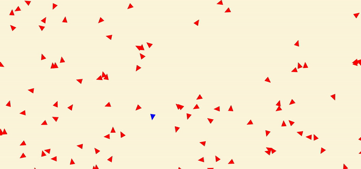

# Boid-Simulator
I was very interested in ALife, the modeling of life using simulation, and I decided to start with a simple but cool project of modeling flocking. While the model isn't perfect, I took inspiration from Craig Reynolds, and his framework for creating flocking.

